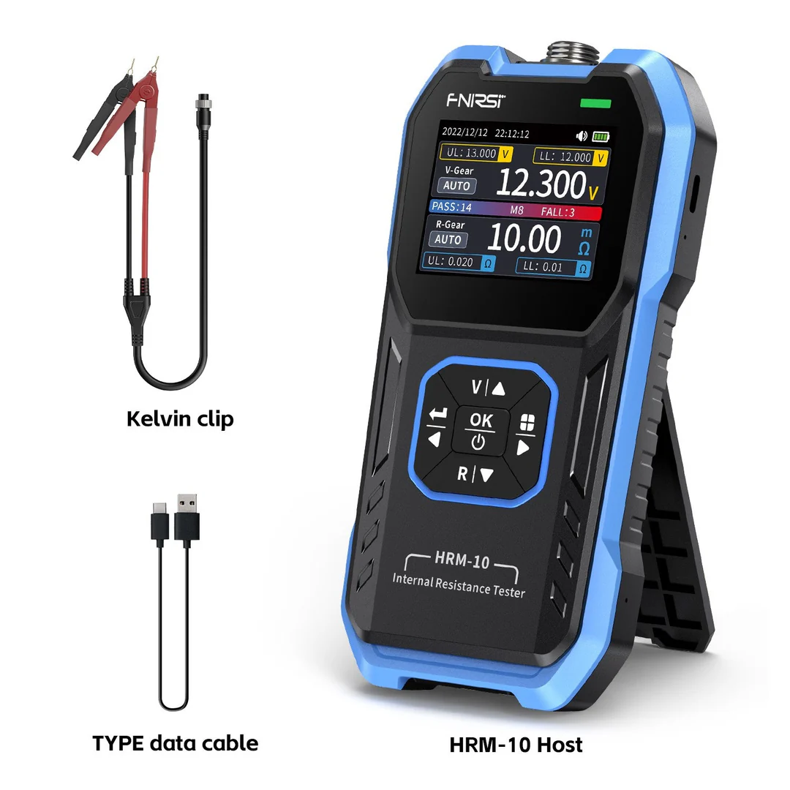

# HRM-10-FNIRSI-RESISTENCIA-DE-BATERIAS

TABLAS REALEAS

| Modelo  | Resistencia Interna      |Material|Voltaje|Marca|Potencia|
|----------|------------|---|---|---|---|
| CR-2032  | 80-90 Ω @ 3.3V   |Lithium| 3 VDC| Beston| |
|CGR18650CG| 100 mΩ| Li-Ion|3.7 VDC| Sin marca| |
|ART18650| 100 mΩ| Li-Ion| 3.7 VDC| UltroFire| 6800 mAh|
|Bat 9V 1604AU| 5 Ω @ 8.9 V| Alcalina | 9 VDC| GP | |

